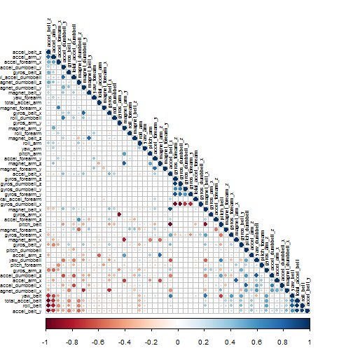

# Practical Machine Leaning Project
Create by Trent Lin Jan. 18 2015

# Executive Summary
Using devices such as Jawbone Up, Nike FuelBand, and Fitbit it is now possible to collect a large amount of data about personal activity relatively inexpensively. These type of devices are part of the quantified self movement ¡V a group of enthusiasts who take measurements about themselves regularly to improve their health, to find patterns in their behavior, or because they are tech geeks. 

This report use data accelerometers on the belt, forearm, arm, and dumbell of 6 participants. http://groupware.les.inf.puc-rio.br/har
I decide to use randomForest model and split the training data(70% belong to training dataset and the other 30% belong to crross validation dataset). Our model accuracy over validation dataset is 99.61%. In addition, this model promoted a excellent predict result for testing dataset. We submmit 20th files answers for assignment, and all of them are correct. 

# Prepare the Environment
## libraries and Set Seed

```r
library(knitr)
library(caret)
```

```
## Loading required package: lattice
## Loading required package: ggplot2
```

```r
library(corrplot)
library(kernlab)
library(randomForest)
```

```
## randomForest 4.6-7
## Type rfNews() to see new features/changes/bug fixes.
```

```r
set.seed(357)
```

## Loading and Preprossing the Data
In this process, we download training dataset from "https://d396qusza40orc.cloudfront.net/predmachlearn/pm and store the training dataset in the destination "./data/pml-training.csv"


## Data Getting and Cleaning
In this process, we load the training dataset. Because there are too many 
"NA" in this dataset, we remove all columns which have NA to avoid noise.In addition, we also remove the first eight indenfiy columns which are username, timestamp etc.


# Modeling
## Split dataset into training and cross validation datasets
The training dataset was split into training and cross validation datasets in 70 : 30 ratio in order to train the randomForest model and implement cross validation.

```
## [1] 13737    53
```

```
## [1] 5885   53
```

## plot a correlation matrix
From the correlation matrix plot, we found that the dark red and blue cicle indicate the hightly negative and positive relationships respectively between two variables. There isn't much concern for highly correlated predictors which means that all of them can be concluded in to the randomForest model. 
 

## randomForest modle
Then we use all predictors to fit a randomForest model. From the result we found that OOB (estimate of error rate) is 0.53%. This number is satisfied enough for cross validation and testing.  

```
## 
## Call:
##  randomForest(formula = classe ~ ., data = training) 
##                Type of random forest: classification
##                      Number of trees: 500
## No. of variables tried at each split: 7
## 
##         OOB estimate of  error rate: 0.59%
## Confusion matrix:
##      A    B    C    D    E class.error
## A 3903    3    0    0    0    0.000768
## B   16 2637    5    0    0    0.007901
## C    1   12 2380    3    0    0.006678
## D    0    0   27 2222    3    0.013321
## E    0    0    2    9 2514    0.004356
```

# Cross Validation
We use the others 30% data from traing set as cross validation dataset to 
validate our modle. From confusionMatrix, we found that the accuracy rate is 99.61%. This model is indeed adequate to preidct new dataset. 

```
## Confusion Matrix and Statistics
## 
##           Reference
## Prediction    A    B    C    D    E
##          A 1673    1    0    0    0
##          B    6 1131    2    0    0
##          C    0    5 1020    1    0
##          D    0    0    7  957    0
##          E    0    0    0    0 1082
## 
## Overall Statistics
##                                         
##                Accuracy : 0.996         
##                  95% CI : (0.994, 0.998)
##     No Information Rate : 0.285         
##     P-Value [Acc > NIR] : <2e-16        
##                                         
##                   Kappa : 0.995         
##  Mcnemar's Test P-Value : NA            
## 
## Statistics by Class:
## 
##                      Class: A Class: B Class: C Class: D Class: E
## Sensitivity             0.996    0.995    0.991    0.999    1.000
## Specificity             1.000    0.998    0.999    0.999    1.000
## Pos Pred Value          0.999    0.993    0.994    0.993    1.000
## Neg Pred Value          0.999    0.999    0.998    1.000    1.000
## Prevalence              0.285    0.193    0.175    0.163    0.184
## Detection Rate          0.284    0.192    0.173    0.163    0.184
## Detection Prevalence    0.284    0.194    0.174    0.164    0.184
## Balanced Accuracy       0.998    0.997    0.995    0.999    1.000
```

# Prediction
In this process we load testing datasets in to R (https://d396qusza40orc.cloudfront.net/predmachlearn/pml-testing.csv) and implement getting and cleaning data process.
We use our model to predict the classe of test data and upload assignment for grade.

```
##  1  2  3  4  5  6  7  8  9 10 11 12 13 14 15 16 17 18 19 20 
##  B  A  B  A  A  E  D  B  A  A  B  C  B  A  E  E  A  B  B  B 
## Levels: A B C D E
```

# Conclution
From our randomFores model the OOB (estimate of error rate) is 0.53% and form confusionMatrix the cross validation dataset accuracy rate is 99.61%. We use this model to predict test data and upload for assignment, all of the 20th answers are correct.
